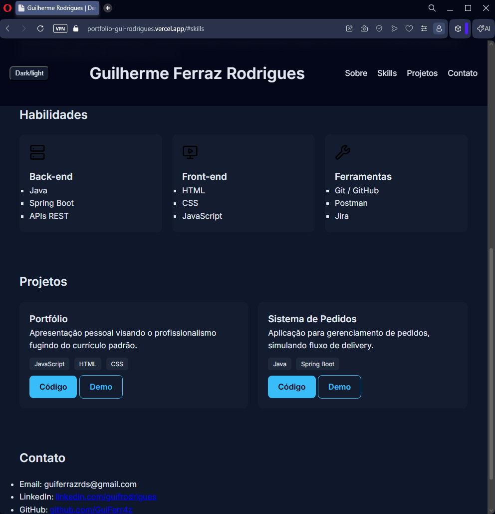

# 💼 Portfólio - Guilherme Ferraz

Este é meu portfólio profissional desenvolvido com foco em apresentar minha trajetória, habilidades e projetos na área de desenvolvimento de software.

---

## 🚀 Tecnologias utilizadas

- HTML5
- CSS3
- JavaScript

---

## 📌 Funcionalidades

- Layout responsivo
- Navegação suave
- Animações ao scroll
- Header fixo
- Dark/Light mode

---

## 🎯 Objetivo

Este projeto foi desenvolvido com o objetivo de consolidar meus conhecimentos em desenvolvimento front-end e criar uma apresentação profissional para recrutadores.

---

## 📸 Preview

---

## 🌐 Acesse o projeto

👉 https://portfolio-gui-rodrigues.vercel.app

---

## 📬 Contato

- LinkedIn: https://www.linkedin.com/in/guifrodrigues/
- GitHub: https://github.com/GuiFerr4z
- Email: guiferrazrds@gmail.com